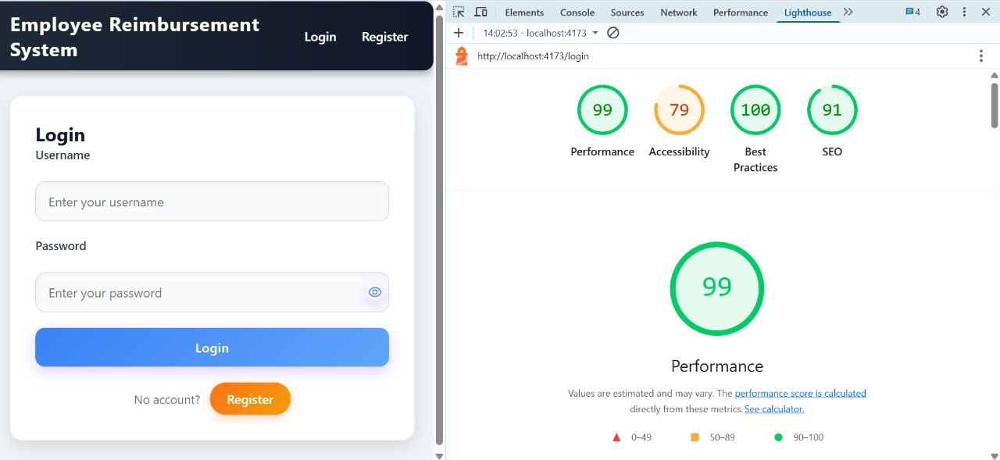

# Expense Reimbursement System (Microservices)

A production-ready, role-based Expense Reimbursement platform built with **Spring Boot microservices**, **Eureka Service Discovery**, **JWT authentication**, and a **React + TypeScript (Vite)** frontend. Data is persisted in **PostgreSQL** (Expense Service) and **MongoDB** (Employee Service). Optional **API Gateway** provides a single entry point.

---

## 🧩 Problem Statement

Organizations need a secure, auditable, and scalable way for employees to submit expense reimbursements and for managers to review, approve, or reject them. Traditional monoliths make scaling and ownership difficult. We need:

* A **clear separation of concerns** across services (Auth, Employee, Expense).
* **Role-based access** for **Admin**, **Manager**, and **Employee**.
* **Secure authentication** with **JWT**.
* **Service discovery** and fault isolation.
* A **clean UI** for employees and managers, with robust history and status tracking.

---

## ✅ Solution Overview

This project implements a **microservices architecture** where each service is independent and discoverable via **Eureka Server**. Authentication is handled using **JWT** with **Spring Security**, and **CORS** is configured to enable secure communication between frontend and backend.

### Core Services

* **Eureka Server** – Service registry where all microservices register and discover each other.
* **Auth Service** – Login/registration, password hashing (**bcrypt**), JWT generation & validation.
* **Employee Service** – Manages users (Admins, Managers, Employees), assignment of roles, manager-employee mapping, and exposes a manager-first API.
* **Expense Service** – Manages reimbursement requests (create, view, approve/reject, delete), with manager review workflows and employee history.
* **API Gateway (optional)** – A single entrypoint that routes requests to services.

### High-Level Architecture

```
[ React + Vite + TS ]  <—CORS—>  [ API Gateway (optional) ]
                                  |            
                                  v            
                           [ Eureka Server ] (service registry)
                              /      |      \
                             v       v       v
                      [Auth]   [Employee]  [Expense]
                         |          |          |
                      Mongo/—   MongoDB    PostgreSQL
```

---

## 🎯 Features

Features by Role

## Employee:

1. Register & Login (JWT)
2. Submit new claim
3. View own claims & history
4. Delete own pending claim

## Manager:

1. Register & Login (JWT)
2. View team’s pending claims
3. Approve/Reject employee claims
4. Create new employee under a manager

## Admin:

1. Register & Login (JWT)
2. Create new employee under a manager
3. Assign roles
4. View all users

### Platform-wide

* **JWT-based auth**; tokens stored in **localStorage** on the frontend.
* **Role-based authorization** via Spring Security method/endpoint guards.
* **Service discovery** using **Eureka**.
* **MongoDB** for employees/managers; **PostgreSQL** for expenses.
* **Clean modular folder structure**: `controller`, `dto`, `exception`, `mapper`, `model`, `repository`, `service`.
* **CORS** config for frontend ↔ backend communication.

---

## 🏗️ Tech Stack

* **Backend**: Java 17, Spring Boot, Spring Web, Spring Data JPA, Spring Security (JWT), Lombok, SLF4J
* **Databases**: PostgreSQL (Expense), MongoDB (Employee)
* **Infra**: Eureka Server, Maven
* **Frontend**: React, TypeScript, Vite
* **Testing**: Postman

---

## 📂 Repository Structure (suggested)

```
root
├─ eureka-server/
├─ auth-service/
├─ employee-service/
├─ expense-service/
├─ api-gateway/               # optional
├─ frontend/                  # React + TS + Vite
└─ docs/
```

Each service follows:

```
service-name/
├─ src/main/java/.../controller
├─ src/main/java/.../dto
├─ src/main/java/.../exception
├─ src/main/java/.../mapper
├─ src/main/java/.../model
├─ src/main/java/.../repository
├─ src/main/java/.../service
└─ src/main/resources/application.yml
```

---

## 🔐 Authentication & Authorization

* **Registration/Login** → handled by **Auth Service**.
* **Password hashing** → **bcrypt**.
* **JWT** → returned on login; the frontend stores it in **localStorage** and attaches it as `Authorization: Bearer <token>` for all calls.
* **Role-based access control** via Spring Security annotations/config.

**JWT Claims (suggested):**

```json
{
  "sub": "userId",
  "email": "user@example.com",
  "role": "EMPLOYEE|MANAGER|ADMIN",
  "exp": 1735689600
}
```

---

## 🧠 Domain Model (simplified)

### Employee Service (MongoDB)

```json
User {
  _id: ObjectId,
  email: string,
  passwordHash: string,
  fullName: string,
  role: "ADMIN" | "MANAGER" | "EMPLOYEE",
  managerId?: string            // for employees
}
```

### Expense Service (PostgreSQL)

```sql
Expense (
  id UUID PRIMARY KEY,
  employeeId VARCHAR NOT NULL,
  amount NUMERIC(12,2) NOT NULL,
  category VARCHAR(50) NOT NULL,
  description TEXT,
  receiptUrl TEXT,
  status VARCHAR(20) NOT NULL DEFAULT 'PENDING', -- PENDING|APPROVED|REJECTED
  createdAt TIMESTAMP NOT NULL,
  updatedAt TIMESTAMP NOT NULL,
  reviewedBy VARCHAR NULL      -- managerId
);
```

---

## 🚦 API Overview

> Endpoints below are representative; adjust to your implementation.

### Auth Service (`/auth`)

* `POST /auth/register` – Create user (admin/manager/employee)
* `POST /auth/login` – Returns JWT

**Login – Request**

```http
POST /auth/login
Content-Type: application/json

{
  "email": "jane@acme.com",
  "password": "Secret@123"
}
```

**Login – Response**

```json
{
  "token": "<JWT>",
  "user": { "id": "...", "email": "jane@acme.com", "role": "MANAGER" }
}
```

### Employee Service (`/employees`)

* `GET /employees/me` – current user profile
* `POST /employees` – (Manager/Admin) create employee
* `GET /employees` – (Admin) list all
* `GET /employees/team` – (Manager) list employees under the manager
* `PATCH /employees/{id}/role` – (Admin) change role

### Expense Service (`/expenses`)

* `POST /expenses` – (Employee) create claim
* `GET /expenses/mine` – (Employee) list own
* `DELETE /expenses/{id}` – (Employee) delete own **pending** claim
* `GET /expenses/pending` – (Manager) list team’s pending claims
* `PATCH /expenses/{id}/approve` – (Manager) approve
* `PATCH /expenses/{id}/reject` – (Manager) reject
* `GET /expenses/approved` – (Manager) list approved
* `GET /expenses/rejected` – (Manager) list rejected

> **Auth**: All above (except register/login) require `Authorization: Bearer <token>`.

---

## 🌐 CORS Configuration

Frontend (Vite) communicates with backend using CORS. Configure allowed origins (e.g. `http://localhost:5173`) in each service’s WebSecurity/Cors config:

```java
@Bean
CorsConfigurationSource corsConfigurationSource() {
  CorsConfiguration configuration = new CorsConfiguration();
  configuration.setAllowedOrigins(List.of("http://localhost:5173"));
  configuration.setAllowedMethods(List.of("GET","POST","PUT","DELETE","PATCH","OPTIONS"));
  configuration.setAllowedHeaders(List.of("Authorization","Content-Type"));
  configuration.setAllowCredentials(true);
  UrlBasedCorsConfigurationSource source = new UrlBasedCorsConfigurationSource();
  source.registerCorsConfiguration("/**", configuration);
  return source;
}
```

---

## ⚙️ Configuration & Environment

### Common Ports (example)

* **Eureka Server**: `8761`
* **Auth Service**: `8081`
* **Employee Service**: `8082`
* **Expense Service**: `8083`
* **API Gateway** (optional): `8080`
* **Frontend (Vite)**: `5173`

### Eureka (application.yml)

```yaml
server:
  port: 8761
spring:
  application:
    name: eureka-server

eureka:
  client:
    register-with-eureka: false
    fetch-registry: false
```

### Client Services (snippet)

```yaml
spring:
  application:
    name: expense-service
  datasource:
    url: jdbc:postgresql://localhost:5432/expenses
    username: postgres
    password: postgres
  jpa:
    hibernate:
      ddl-auto: update
    show-sql: true

server:
  port: 8083

eureka:
  client:
    serviceUrl:
      defaultZone: http://localhost:8761/eureka/
```

### Environment Variables (suggested)

* `JWT_SECRET` – secret for token signing (Auth Service)
* `MONGO_URI` – Employee Service
* `POSTGRES_URL`, `POSTGRES_USER`, `POSTGRES_PASSWORD` – Expense Service
* `EUREKA_URI` – e.g. `http://localhost:8761/eureka/`
* `FRONTEND_ORIGIN` – e.g. `http://localhost:5173`

---

## 🧪 Running Locally

### 1) Start Databases

* **PostgreSQL** and **MongoDB** locally or via Docker.

```bash
# PostgreSQL
docker run -d --name pg -e POSTGRES_PASSWORD=postgres -e POSTGRES_DB=expenses -p 5432:5432 postgres:16

# MongoDB
docker run -d --name mongo -p 27017:27017 mongo:7
```

### 2) Start Eureka Server

```bash
cd eureka-server
mvn spring-boot:run
```

Visit `http://localhost:8761` to verify registry.

### 3) Start Services (in separate terminals)

```bash
cd auth-service && mvn spring-boot:run
cd employee-service && mvn spring-boot:run
cd expense-service && mvn spring-boot:run
```

### 4) (Optional) Start API Gateway

```bash
cd api-gateway && mvn spring-boot:run
```

### 5) Start Frontend

```bash
cd frontend
npm install
npm run dev
```

Open `http://localhost:5173`.

---

## 🧭 Frontend Behavior (React + TS + Vite)

* **Login/Register** → calls Auth Service; stores `token` in `localStorage`.
* Every API call attaches `Authorization: Bearer <token>`.
* **Employee UI**: submit request, view history, delete pending.
* **Manager UI**: team’s pending, approve/reject, view approved/rejected, create employee.
* **Admin UI**: manage roles, list users.

---

## 🧱 Sample cURL

```bash
# Login
curl -X POST http://localhost:8081/auth/login \
  -H "Content-Type: application/json" \
  -d '{"email":"manager@acme.com","password":"Secret@123"}'

# Create Expense (Employee)
curl -X POST http://localhost:8083/expenses \
  -H "Authorization: Bearer <JWT>" -H "Content-Type: application/json" \
  -d '{"amount": 1200.50, "category":"TRAVEL", "description":"Taxi from airport"}'

# Approve Expense (Manager)
curl -X PATCH http://localhost:8083/expenses/{id}/approve \
  -H "Authorization: Bearer <JWT>"
```

---

## 🛡️ Security Notes

* Use a strong `JWT_SECRET` and **never commit it**.
* Prefer **HTTPS** in production.
* Validate payloads at DTO level (e.g., `@NotNull`, `@Positive`).
* Ensure **method-level security** for sensitive actions.
* Log with **SLF4J** (avoid logging secrets).

---

## 🧰 Error Handling (example)

Unified error response from exception handlers:

```json
{
  "timestamp": "2025-08-22T10:20:30Z",
  "status": 400,
  "error": "Bad Request",
  "message": "Amount must be positive",
  "path": "/expenses"
}
```

---

## 🔄 Manager & Employee Workflows

### Manager

1. Create employee(s) and assign them under the manager.
2. View **pending** claims of direct reports.
3. **Approve/Reject** with optional reason.
4. View **approved** and **rejected** lists.

### Employee

1. Create a **new claim** with amount/category/description/receipt (optional URL).
2. View **history** of all claims.
3. **Delete** only if the claim is still **PENDING**.

---

## 🧱 DTO Examples

```json
// CreateExpenseRequest
{
  "amount": 350.00,
  "category": "MEALS",
  "description": "Client lunch",
  "receiptUrl": "https://..."
}

// Approve/Reject (optional body)
{
  "reason": "Within policy"
}
```

---

## 🧭 Postman

* Configure an **Environment** with `baseUrl`, `token`.
* Create collections for Auth, Employee, Expense.
* Use `{{token}}` in Authorization header.

---

## 🚀 Deployment Notes

* Containerize each service; use **Docker Compose** or **Kubernetes**.
* Externalize configuration via env vars/Config Server.
* Use separate DB instances for isolation.
* Horizontal scale stateless services behind a gateway.

**Sample docker-compose.yml (snippet)**

```yaml
version: "3.9"
services:
  eureka:
    build: ./eureka-server
    ports: ["8761:8761"]

  auth:
    build: ./auth-service
    environment:
      - JWT_SECRET=${JWT_SECRET}
      - EUREKA_URI=http://eureka:8761/eureka/
    depends_on: [eureka]

  employee:
    build: ./employee-service
    environment:
      - MONGO_URI=mongodb://mongo:27017/employees
      - EUREKA_URI=http://eureka:8761/eureka/
    depends_on: [eureka, mongo]

  expense:
    build: ./expense-service
    environment:
      - POSTGRES_URL=jdbc:postgresql://postgres:5432/expenses
      - POSTGRES_USER=postgres
      - POSTGRES_PASSWORD=postgres
      - EUREKA_URI=http://eureka:8761/eureka/
    depends_on: [eureka, postgres]

  mongo:
    image: mongo:7
    ports: ["27017:27017"]

  postgres:
    image: postgres:16
    environment:
      - POSTGRES_PASSWORD=postgres
      - POSTGRES_DB=expenses
    ports: ["5432:5432"]
```

---

## 🔮 Future Enhancements

* File upload service for **receipt images** (S3/Cloud Storage)
* **Email/Slack** notifications on status changes
* **Pagination & filtering** for manager dashboards
* **Audit trail** & approval comments
* **API Gateway** with rate limiting & circuit breaking
* **OpenAPI/Swagger** docs per service
* **E2E tests** and CI/CD


# Reports & CI/CD Documentation

This section complements the main README by providing visual assets and pipeline automation details.

---

## 📊 System Flow Diagram

Below is the high-level flow diagram of the Expense Reimbursement System:


---

## 🔄 Jenkins Pipeline (Local)

The Jenkins pipeline automates build, test, and static code analysis for each microservice. Below is the full `Jenkinsfile`:

```groovy
pipeline {
    agent any

    tools {
        maven 'MAVEN_HOME'   // must match Jenkins tool config
    }

    environment {
        // Local paths for your 4 microservices
        AUTH_SERVICE       = "C:\\Users\\pawanmehta\\SpringBoot\\ERS_MICROSERVICE\\auth-service"
        EMPLOYEE_SERVICE   = "C:\\Users\\pawanmehta\\springBoot\\ERS_MICROSERVICE\\employee-service"
        EUREKA_SERVICE     = "C:\\Users\\pawanmehta\\SpringBoot\\ERS_MICROSERVICE\\eureka-service"
        EXPENSE_SERVICE    = "C:\\Users\\pawanmehta\\SpringBoot\\ERS_MICROSERVICE\\expense-service"

        // SonarQube token
        SONARQUBE_TOKEN = "squ_xxxxxxxxxxxxxxxxxxxxxxxxxxxxxxxxxxxxx"

        // SonarQube project keys
        AUTH_PROJECT_KEY     = "auth-service"
        EMPLOYEE_PROJECT_KEY = "employee-service"
        EUREKA_PROJECT_KEY   = "eureka-service"
        EXPENSE_PROJECT_KEY  = "expense-service"

        SONAR_HOST = "http://localhost:9000"
    }

    stages {
        stage('Build & Test: Auth Service') {
            steps {
                dir("${AUTH_SERVICE}") {
                    bat "mvn clean verify"
                }
            }
            post {
                always {
                    junit allowEmptyResults: true, testResults: 'target/surefire-reports/*.xml'
                    jacoco execPattern: 'target/jacoco.exec', classPattern: 'target/classes', sourcePattern: 'src/main/java'
                }
            }
        }

        stage('SonarQube: Auth Service') {
            steps {
                dir("${AUTH_SERVICE}") {
                    bat """
                        mvn sonar:sonar ^
                        -Dsonar.projectKey=${AUTH_PROJECT_KEY} ^
                        -Dsonar.login=${SONARQUBE_TOKEN} ^
                        -Dsonar.host.url=${SONAR_HOST} ^
                        -Dsonar.coverage.jacoco.xmlReportPaths=target/site/jacoco/jacoco.xml
                    """
                }
            }
        }

        // Repeat stages for Employee, Eureka, Expense services (Build, Test, Sonar)

    }

    post {
        success {
            echo 'All microservices built, tested, and analyzed successfully.'
        }
        failure {
            echo 'Build or SonarQube analysis failed.'
        }
    }
}
```

---

##  Jenkins Pipeline


## 📈 SonarQube Reports

Each service is analyzed with **SonarQube** for code quality, coverage, and security vulnerabilities.

* **Auth Service Report:**  
* **Employee Service Report:** 


---

## 🌐 Lighthouse Report (Frontend)

Frontend performance, accessibility, best practices, and SEO were measured using **Google Lighthouse**.

* **Report Screenshot:** 


---

## 🎥 Application Demo Video

A complete demo video showcasing login, employee claims, manager approvals, and admin role management.

[▶️ Watch the Demo](docs/demo.mp4)

## 🎥 Google Drive Link
https://drive.google.com/file/d/1Api2t0zEDmMjwY_dQuloaAccukkPN_UM/view?usp=drive_link


---

## 📜 License

Specify your license here (e.g., MIT) or add a `LICENSE` file.

---

## 🙌 Acknowledgements

* Spring Boot, Spring Security, Spring Data, Eureka
* PostgreSQL, MongoDB
* React, TypeScript, Vite

---

**Made with ❤️ using Spring Boot microservices + React (Vite + TS) by Pawan Mehta**
